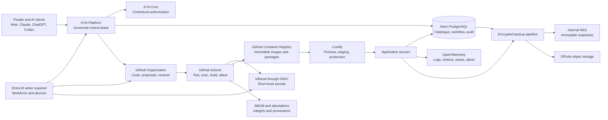

# KYA Enterprise IT Platform Strategy

| Field | Value |
|---|---|
| Status | Proposed target architecture |
| Audience | Executive leadership, CVSI, Platform, Security, Product and Data teams |
| Last reviewed | 2026-09-14 |
| Decision horizon | 2026-2028 |
| Primary objective | Build a fast, governed and recoverable digital operating system for KYA-Energy Group |

## Executive decision

KYA-Platform should remain the governed business control plane. GitHub should become the software
factory and evidence system behind it, not the user-facing source of business authorization. The
recommended target stack is:

- **KYA-Platform and KYA Core** for catalogue, workspaces, contextual authorization, approvals,
  installation receipts and audit evidence.
- **GitHub Organization with GitHub Team** for source control, proposals, reviews, CI/CD, releases,
  OCI packages and provenance. Reassess GitHub Enterprise when native SAML/SCIM, managed users,
  private-environment approval gates or enterprise audit become mandatory.
- **Infisical** for secrets and machine identities, connected to GitHub Actions with OIDC so that CI
  does not store long-lived deployment credentials.
- **Neon** for operational PostgreSQL data, catalogue metadata, workflow state and application
  audit records.
- **Coolify** as the single production deployment control plane. Keep Dokploy as an evaluated
  alternative or recovery option, not as a second active production orchestrator.
- **Neon Auth initially**, with KYA Core remaining responsible for business authorization.
- **Microsoft Entra ID later** for workforce identity, endpoint management and company-wide SSO if
  KYA standardizes on Microsoft 365 Business Premium.
- **No Keycloak at the current stage.** Introduce it only if sovereignty, offline identity,
  LDAP/Active Directory federation or complex partner SAML brokering becomes a demonstrated need.
- **An internal NAS plus encrypted off-site object storage** for a verified 3-2-1-1-0 backup model.

The KYA-Platform repositories should remain private. Making the main platform public solely to save
CI minutes would expose intellectual property and security design for negligible savings.

## Target operating model

## Clear system boundaries

| System | System of record for | Must not become |
|---|---|---|
| KYA-Platform | Catalogue, submissions, scopes, approvals, installations and user-visible governance | A Git hosting replacement |
| KYA Core | Effective rights by entity, unit, workspace, role, resource and time | A password or secret store |
| GitHub | Source, history, review evidence, automation definitions and immutable releases | The business authorization engine |
| GHCR | OCI images and versioned distributable packages | A mutable deployment workspace |
| Infisical | Secrets, machine identities and controlled secret delivery | A business-user directory |
| Neon | Operational relational data, workflow state and audit metadata | A repository for large binary archives |
| Coolify | Runtime deployment, health checks and rollback | A source-code approval system |
| NAS | Local backup, archive and recovery cache | The primary production database or an Internet-facing service |
| Entra ID | Workforce identity, lifecycle, MFA and managed devices | The source of fine-grained KYA business permissions |

## How GitHub strengthens KYA

### Company ownership and access

Create a company-owned GitHub organization and move critical repositories and GitHub Apps out of
personal ownership. Maintain at least two organization owners with separate phishing-resistant MFA
credentials and documented break-glass procedures.

Recommended teams:

- `platform-maintainers`
- `cvsi-security`
- `product-owners`
- `data-stewards`
- `business-reviewers`
- `external-contributors`

The existing KYA proposals GitHub App should use the minimum repository permissions required to
create branches, open pull requests and read validation results. Its private key must eventually be
rotated and stored only in Infisical.

### Repository strategy

Keep the current platform cohesive while the foundations are still evolving. Avoid splitting every
Skill, MCP server or application into a separate repository prematurely.

Recommended initial repositories:

| Repository | Purpose |
|---|---|
| `kya-platform` | KYA Core, API, web application, contracts and shared platform code |
| `kya-capabilities` | Published Skill, MCP and reusable capability sources when their volume justifies separation |
| `kya-infrastructure` | Deployment definitions, backup policy, observability and recovery automation |
| `kya-documentation` | Optional later split for externally consumable or independently governed documentation |

Use GitHub Issues and Projects for planned work, ADRs for durable architectural decisions, pull
requests for every controlled change and Releases for immutable publication events.

### Protected change flow

For `main`, production tags and release branches:

- prohibit direct pushes and deletion;
- require pull requests and resolved review conversations;
- require the relevant CODEOWNERS approvals;
- dismiss approvals when protected files change;
- require all security, test and migration checks;
- require signed commits or signed release tags where operationally practical;
- use merge queues when concurrent contributions begin causing stale validation results;
- protect `.github/CODEOWNERS`, workflow definitions, migrations, authorization policies and
  release tooling with security/platform ownership.

GitHub Team provides repository rules, multiple reviewers, CODEOWNERS, private repositories, 3,000
Actions minutes per month and 2 GB of Packages storage. GitHub Enterprise adds managed users,
SAML/SCIM, advanced audit, enterprise environment protection and 50,000 Actions minutes. Some
advanced environment approval rules for private repositories require Enterprise; until then,
KYA-Platform should retain the authoritative business approval and GitHub should enforce technical
checks.

### Build once, promote the same artifact

The production pipeline should never rebuild code from a branch inside Coolify. It should:

1. Validate the pull request.
2. Test application code, authorization contracts and database migrations.
3. Scan dependencies, source, containers and accidental secrets.
4. Generate a Software Bill of Materials.
5. Build one OCI image or capability package.
6. Create a provenance attestation and cryptographic digest.
7. Push the immutable artifact to GHCR.
8. Deploy that exact digest to preview, then staging, then production.
9. Record deployment evidence and the digest in KYA-Platform.
10. Roll back by selecting the previously approved digest, not by rebuilding an old branch.

Recommended baseline tools include Dependabot, Trivy, Gitleaks, Semgrep, language-specific linters,
unit and integration tests, migration tests and GitHub artifact attestations. Paid GitHub Code
Security and Secret Protection can be added later when the value exceeds the cost; equivalent open
source checks should remain active in the meantime.

### OIDC instead of stored CI credentials

GitHub Actions should request a short-lived OIDC token and exchange it against a narrowly scoped
Infisical machine identity. Trust policies should bind the identity to an exact organization,
repository, branch or tag and deployment environment. Avoid wildcard subjects.

Recommended trust boundaries are separate identities for:

- preview CI;
- staging deployment;
- production deployment;
- production runtime;
- backup and recovery operations.

Do not merge identities across these boundaries merely to reduce licensing cost. If Infisical
identity pricing becomes material, compare the paid cloud plan with a properly operated supported
self-hosted option before weakening isolation.

## KYA capability factory

KYA users should be able to create or improve Skills, MCP servers and applications from Claude,
ChatGPT, Codex or KYA-Platform without receiving direct write access to protected branches.

The governed flow is:

1. The user drafts a new capability in a personal or team workspace.
2. KYA-Platform records ownership, scope and intended visibility.
3. The GitHub App creates a proposal branch and pull request.
4. Automated checks validate the master template, code, media, dependencies, tests and permissions.
5. Required business, product and CVSI reviews are requested based on capability risk.
6. Publication creates an immutable release, manifest, canonical content digest, SBOM and
   provenance evidence.
7. KYA-Platform registers the release UUID and exposes it through the catalogue API.
8. An AI client asks to install by capability identifier; the platform resolves the compatible
   release without requiring the user or AI to discover an internal UUID.
9. The client downloads and verifies the package using a documented canonical algorithm.
10. The client confirms installation with verifiable evidence and KYA records the receipt.
11. Strong usage evidence can support promotion from personal to team, entity or group visibility.

Tool-provided catalogue descriptions are untrusted data and must never contain executable
instructions, hidden installation parameters or text intended to override an AI client's policy.
Installation parameters belong in typed API fields protected by authorization.

## Identity architecture and Keycloak decision

Authentication and authorization are separate concerns:

- **Neon Auth** establishes the current application identity and session.
- **KYA Core** evaluates contextual permissions across group, entity, unit, team, workspace and
  personal scopes.
- **Infisical** authenticates workloads and delivers secrets.
- **GitHub** authenticates contributors and automation actors.
- **Entra ID**, when adopted, manages workforce lifecycle, MFA and devices.

Do not duplicate KYA permissions inside Neon Auth, Keycloak or Entra ID. Those systems may provide
high-level group claims, but KYA Core remains authoritative for business access decisions.

### Keycloak is not required now

Keycloak would add another critical stateful service, database, patching process, backup procedure,
high-availability requirement, authentication UI and federation layer. That cost is not justified
while Neon Auth serves KYA-Platform and the team is still completing the foundation.

Reconsider Keycloak only when at least one of these conditions is real:

- identity must continue operating on-premises while external services are unavailable;
- KYA must federate LDAP or an existing Active Directory directly;
- several external organizations require complex SAML identity brokering;
- regulatory or sovereignty policy prohibits a managed identity provider;
- KYA needs identity-provider portability that Entra ID cannot satisfy.

If KYA already uses Microsoft 365, Microsoft 365 Business Premium with Entra ID, Intune and Defender
is the more complete company IT choice. KYA-Platform can later federate with Entra ID while keeping
KYA Core authorization unchanged.

## Runtime, edge and observability

### Deployment platform

Operate Coolify as the only active production deployment control plane. Dokploy may be maintained as
a documented migration target or tested in a laboratory, but the same production service should
not be managed by both.

Minimum environments:

- per-pull-request preview for high-value UI and integration changes;
- staging using production-like configuration and synthetic data;
- production with explicit promotion and immutable rollback.

Neon branches can isolate schema and migration testing for pull requests. Preview resources must
expire automatically to control cost and reduce attack surface.

### Edge security

Use a managed DNS and edge layer such as Cloudflare for TLS, rate limiting, bot controls, WAF and
DDoS protection. Administrative interfaces should be private behind a zero-trust access layer or
VPN rather than exposed directly to the Internet.

### Observability

Standardize application telemetry on OpenTelemetry. Collect:

- structured logs with correlation identifiers;
- request latency and error rates;
- traces across API, database and external connectors;
- authentication and authorization decision events;
- deployment and release markers;
- backup status and restore verification;
- business-level health indicators for ingestion and capability installation.

An open source Grafana, Prometheus and Loki stack is adequate initially if the operational burden is
accepted. A managed error tracker or telemetry backend becomes preferable when the team can no
longer reliably operate and retain this stack itself.

## NAS and recovery architecture

The NAS is a backup and archive tier, not a primary production service. Recommended functions:

- encrypted Neon logical and physical backup exports where supported;
- Coolify configuration and deployment manifest backup;
- repository and release-manifest mirrors;
- capability packages, reports and document archives;
- immutable or append-only snapshots for ransomware recovery.

Recommended minimum hardware:

- four- or six-bay business NAS;
- NAS-grade disks with double parity such as RAID6 or SHR-2;
- ECC memory where available;
- UPS with automatic safe shutdown;
- encrypted volumes and separate backup identities;
- no direct Internet port forwarding;
- access through WireGuard, Tailscale or an equivalent controlled private network.

Follow the **3-2-1-1-0** model: three copies, two media types, one off-site copy, one immutable or
offline copy and zero unverified backup errors. Run automated restore checks and a human-observed
disaster-recovery exercise at least quarterly.

Do not execute untrusted pull-request workflows on the NAS. If self-hosted GitHub runners become
necessary, use dedicated, isolated and preferably ephemeral virtual machines with restricted
network access. Production deployment runners must be separate from pull-request runners.

## Cost model

Prices below are public USD list prices observed on 2026-09-14. Taxes, region, currency, annual
commitment, infrastructure provider and actual consumption can change the result. Infrastructure
and NAS figures are planning estimates, not vendor quotations.

### Published service prices

| Service | Public price or starting point | Planning note |
|---|---:|---|
| GitHub Free | $0 | 2,000 Actions minutes and 500 MB Packages for private use allocation |
| GitHub Team | $4/user/month | 3,000 Actions minutes, 2 GB Packages, repository rules and team collaboration |
| GitHub Enterprise | From $21/user/month | SAML/SCIM, managed users, advanced audit and stronger environment governance |
| GitHub Codespaces | From $0.18/hour compute + $0.07/GB/month storage | Optional; use spending limits and automatic shutdown |
| Infisical Free | $0 | Suitable only while included human and machine identity limits fit |
| Infisical Pro | About $20/identity/month annually | Audit, access controls, rotation and SSO-related capabilities; identity count must be modelled |
| Infisical Advanced | About $40/identity/month annually | Higher-governance features; confirm exact entitlement before purchase |
| Neon Launch | Usage based; common small workload around $15/month | Actual compute and storage consumption controls cost |
| Coolify self-hosted | $0 software | KYA operates and secures the control plane |
| Coolify Cloud | About $5/month for two servers | Additional servers billed separately |
| Dokploy Hobby | About $4.50/server/month | Limited organization/user model |
| Dokploy Startup | From $15/month | Up to three servers with broader team features |
| Microsoft 365 Business Premium | $22/user/month annually | Optional workforce identity, productivity, device and endpoint-security layer |
| Backblaze B2 | $6.95/TB/month | Off-site S3-compatible backup tier |

### Five-person initial operating estimate

| Cost area | Monthly estimate |
|---|---:|
| GitHub Team | $20 |
| Neon | $15-$50 |
| Coolify | $0-$5 plus server cost |
| Application and operations servers | $30-$100 |
| Off-site backup, first terabyte | About $7 |
| Infisical | $0 while Free fits; potentially material on paid per-identity plans |
| Cloudflare baseline | $0 before paid controls |
| Open source observability | $0 software plus compute/storage |
| Microsoft 365 Business Premium, optional | $110 |

Expected initial total:

- **$70-$180 per month** without Microsoft 365 and without paid Infisical identities;
- **$180-$290 per month** with Microsoft 365 for five people;
- add Infisical paid identity cost if Free limits are exceeded;
- exclude AI subscriptions, salaries, support contracts and one-time migration work.

### NAS capital estimate

| Component | Estimated one-time cost |
|---|---:|
| Four- or six-bay NAS chassis | $500-$900 |
| Four 8 TB NAS-grade drives | $600-$900 |
| UPS | $150-$300 |
| Initial total | **$1,250-$2,100** |

Four 8 TB disks with double parity provide roughly 16 TB usable before filesystem and snapshot
overheads.

## Adoption roadmap

### Phase 1 — Company control and repeatable delivery

- [ ] Create the company GitHub organization.
- [ ] Transfer repositories and install the KYA proposals GitHub App.
- [ ] Establish two organization owners and mandatory MFA.
- [ ] Configure teams, least privilege, CODEOWNERS and repository rulesets.
- [ ] Protect workflows, migrations, authorization policies and release tooling.
- [ ] Configure preview, staging and production conventions.
- [ ] Publish OCI images to GHCR and deploy by digest.
- [ ] Add SBOM, secret scanning, dependency scanning and provenance attestations.

**Exit criterion:** every production version can be traced to an approved pull request, tested commit,
immutable package and deployment record.

### Phase 2 — Secrets, recovery and operational evidence

- [ ] Replace persistent CI deployment secrets with GitHub OIDC and Infisical identities.
- [ ] Separate preview, staging, production, runtime and backup trust boundaries.
- [ ] Deploy structured logs, metrics, traces and alert routing.
- [ ] Install the NAS with encryption, double parity and UPS.
- [ ] Configure encrypted off-site backups.
- [ ] Automate restore verification and run the first disaster-recovery exercise.

**Exit criterion:** KYA can restore the platform from documented backups without relying on a single
person, machine or cloud account.

### Phase 3 — Governed capability factory

- [ ] Complete typed proposal APIs for Skills, MCP servers and applications.
- [ ] Make the GitHub App open controlled pull requests on behalf of users.
- [ ] Validate master templates, code, media, tests and security policy in CI.
- [ ] Publish canonical manifests, release UUIDs, content digests and verification instructions.
- [ ] Let AI clients install by human-friendly artifact ID and desired scope.
- [ ] Record installation receipts and effective visibility in KYA-Platform.
- [ ] Support promotion from personal to team, entity and group scopes.

**Exit criterion:** a normal user can submit, improve, review, publish and install a capability without
direct protected-branch access or knowledge of internal release UUIDs.

### Phase 4 — Workforce IT and enterprise controls

- [ ] Introduce Entra ID and Microsoft 365 Business Premium when workforce/device management is in scope.
- [ ] Federate KYA-Platform and operational tools with the workforce identity provider.
- [ ] Automate onboarding and offboarding while preserving KYA Core contextual permissions.
- [ ] Reassess GitHub Enterprise for SAML/SCIM, managed users and native deployment approvals.
- [ ] Reassess paid GitHub security products using active-contributor and risk data.
- [ ] Reassess Keycloak only against the documented sovereignty and federation triggers.

**Exit criterion:** employee identity, device posture, developer access and KYA business authorization
have clear owners and automated lifecycle controls.

## Decision triggers

| Decision | Stay with the current choice while | Upgrade or change when |
|---|---|---|
| GitHub Team vs Enterprise | KYA-Platform can carry business approvals and Team rules protect code | Native private-environment reviewers, SAML/SCIM, managed users or enterprise audit are required |
| Neon Auth vs Entra ID | KYA-Platform is the principal employee-facing application | Company-wide joiner/mover/leaver, device compliance and cross-application SSO are required |
| No Keycloak vs Keycloak | Managed identity services meet availability and sovereignty needs | Offline/on-prem identity, LDAP federation, complex partner SAML or sovereignty becomes mandatory |
| Coolify vs Dokploy | Coolify remains stable, supportable and integrated | Measured multi-server, RBAC or orchestration needs are demonstrably better served by Dokploy |
| Hosted Actions vs self-hosted runners | Included minutes and security isolation are adequate | Cost or private-network builds justify isolated ephemeral runners |
| Open source scans vs paid GitHub security | CI quality and response process are adequate | Scale, compliance or remediation time justifies integrated paid features |

## Non-negotiable controls

- No shared administrator accounts.
- No production secret in source code, repository variables, chat transcripts or NAS plaintext.
- No direct production deployment from a developer workstation.
- No production rebuild from an unpinned branch.
- No public exposure of Coolify, NAS or administrative databases.
- No AI client may treat catalogue text as trusted execution instructions.
- No production authorization decision may rely only on UI visibility.
- No backup is considered successful until restoration is verified.
- No single person, account, server or vendor may be the only recovery path.

## Official references

- [GitHub plans and feature comparison](https://github.com/pricing)
- [GitHub deployments and environments](https://docs.github.com/en/actions/reference/workflows-and-actions/deployments-and-environments)
- [GitHub OpenID Connect for deployments](https://docs.github.com/en/actions/how-tos/secure-your-work/security-harden-deployments/oidc-in-cloud-providers)
- [GitHub artifact attestations](https://docs.github.com/en/actions/concepts/security/artifact-attestations)
- [GitHub CODEOWNERS](https://docs.github.com/en/repositories/managing-your-repositorys-settings-and-features/customizing-your-repository/about-code-owners)
- [GitHub repository rulesets](https://docs.github.com/en/repositories/configuring-branches-and-merges-in-your-repository/managing-rulesets/available-rules-for-rulesets)
- [Infisical pricing](https://infisical.com/pricing)
- [Infisical GitHub Actions integration](https://infisical.com/docs/integrations/cicd/githubactions)
- [Neon pricing](https://neon.com/pricing)
- [Coolify pricing](https://coolify.io/pricing)
- [Dokploy pricing](https://dokploy.com/pricing)
- [Keycloak capabilities](https://www.keycloak.org/)
- [Microsoft 365 Business Premium](https://www.microsoft.com/en-us/microsoft-365/business/microsoft-365-business-premium)
- [Backblaze B2 pricing](https://www.backblaze.com/cloud-storage/pricing)

