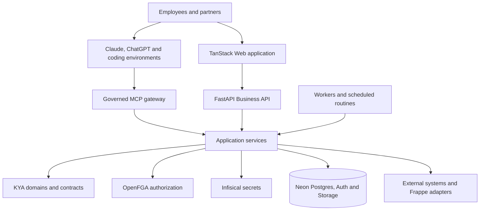

# Architecture overview

KYA Platform is a modular monolith with multiple delivery surfaces. The Web application, Business
API, MCP gateway and workers reuse the same application services and domain rules.



## Dependency direction

The protected source dependency direction is:

```text
API / MCP / workers → application → domain and contracts
infrastructure implements application-facing ports
```

Architecture tests reject domain imports from outer layers and application imports from delivery or
infrastructure layers.
