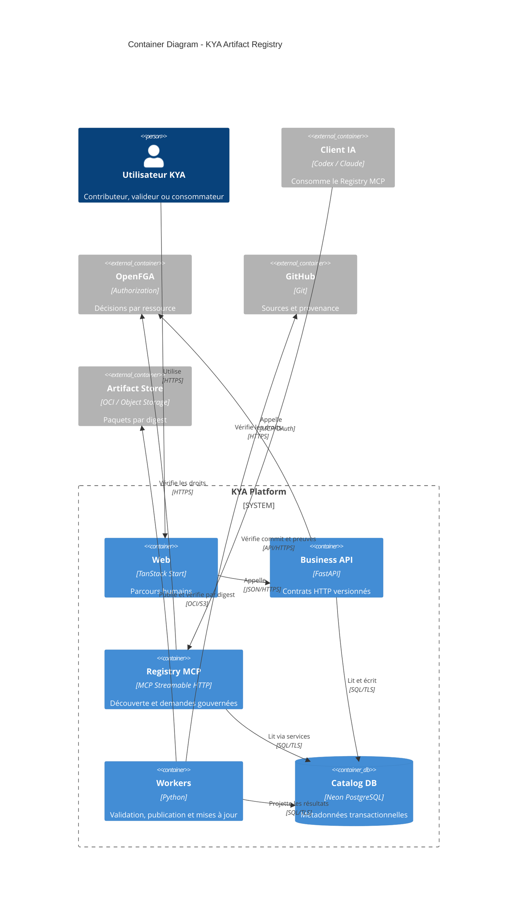

# C4 Containers — KYA Artifact Registry

```mermaid
C4Container
  title Container Diagram - KYA Artifact Registry
  Person(user, "Utilisateur KYA", "Contributeur, valideur ou consommateur")
  Container_Ext(client, "Client IA", "Codex / Claude", "Consomme le Registry MCP")
  System_Boundary(platform, "KYA Platform") {
    Container(web, "Web", "TanStack Start", "Parcours humains")
    Container(api, "Business API", "FastAPI", "Contrats HTTP versionnés")
    Container(mcp, "Registry MCP", "MCP Streamable HTTP", "Découverte et demandes gouvernées")
    Container(worker, "Workers", "Python", "Validation, publication et mises à jour")
    ContainerDb(neon, "Catalog DB", "Neon PostgreSQL", "Métadonnées transactionnelles")
  }
  Container_Ext(openfga, "OpenFGA", "Authorization", "Décisions par ressource")
  Container_Ext(git, "GitHub", "Git", "Sources et provenance")
  Container_Ext(blob, "Artifact Store", "OCI / Object Storage", "Paquets par digest")
  Rel(user, web, "Utilise", "HTTPS")
  Rel(web, api, "Appelle", "JSON/HTTPS")
  Rel(client, mcp, "Appelle", "MCP/OAuth")
  Rel(api, neon, "Lit et écrit", "SQL/TLS")
  Rel(mcp, neon, "Lit via services", "SQL/TLS")
  Rel(api, openfga, "Vérifie les droits", "HTTPS")
  Rel(mcp, openfga, "Vérifie les droits", "HTTPS")
  Rel(worker, git, "Vérifie commit et preuves", "API/HTTPS")
  Rel(worker, blob, "Publie et vérifie par digest", "OCI/S3")
  Rel(worker, neon, "Projette les résultats", "SQL/TLS")
```
