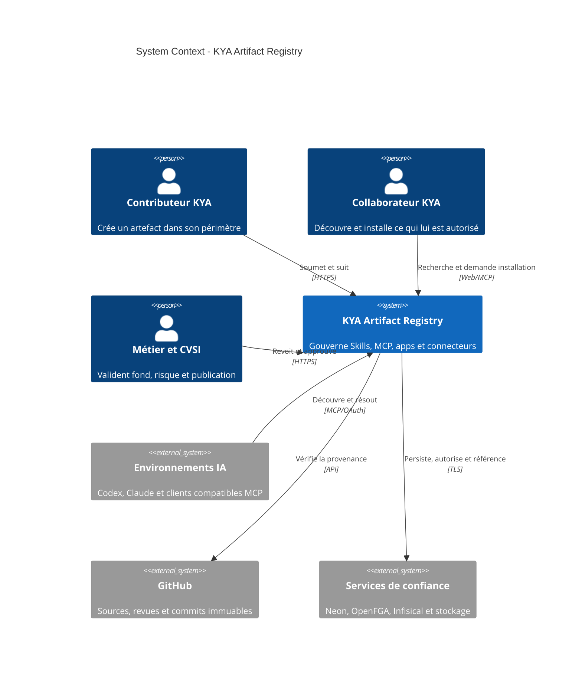

# C4 Context — KYA Artifact Registry

```mermaid
C4Context
  title System Context - KYA Artifact Registry
  Person(contributor, "Contributeur KYA", "Crée un artefact dans son périmètre")
  Person(consumer, "Collaborateur KYA", "Découvre et installe ce qui lui est autorisé")
  Person(reviewer, "Métier et CVSI", "Valident fond, risque et publication")
  System(registry, "KYA Artifact Registry", "Gouverne Skills, MCP, apps et connecteurs")
  System_Ext(aiClients, "Environnements IA", "Codex, Claude et clients compatibles MCP")
  System_Ext(github, "GitHub", "Sources, revues et commits immuables")
  System_Ext(authorities, "Services de confiance", "Neon, OpenFGA, Infisical et stockage")
  Rel(contributor, registry, "Soumet et suit", "HTTPS")
  Rel(reviewer, registry, "Revoit et approuve", "HTTPS")
  Rel(consumer, registry, "Recherche et demande installation", "Web/MCP")
  Rel(aiClients, registry, "Découvre et résout", "MCP/OAuth")
  Rel(registry, github, "Vérifie la provenance", "API")
  Rel(registry, authorities, "Persiste, autorise et référence", "TLS")
```
